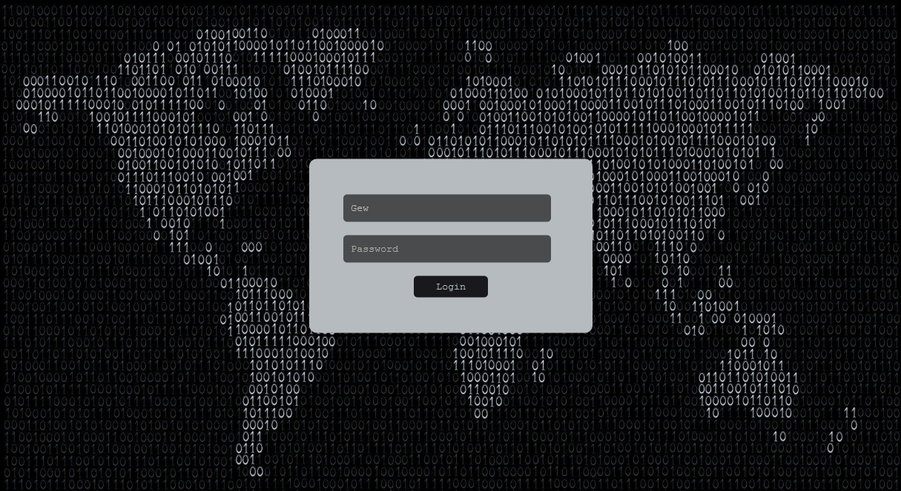

# FeelFreeToAttack
User Based Web Application, developed within Cyber Security course project - use it in order to commit SQL attacks :)

Before you start working with it:
<ul>
<li>Upload all files from directory to your server (you can also use EasyPHP DevServer or XAMPP).</li>
<li>Create new database and import `users` table there.</li>
<li>Change database credentials in config.php and db.php files.</li>
</ul>
